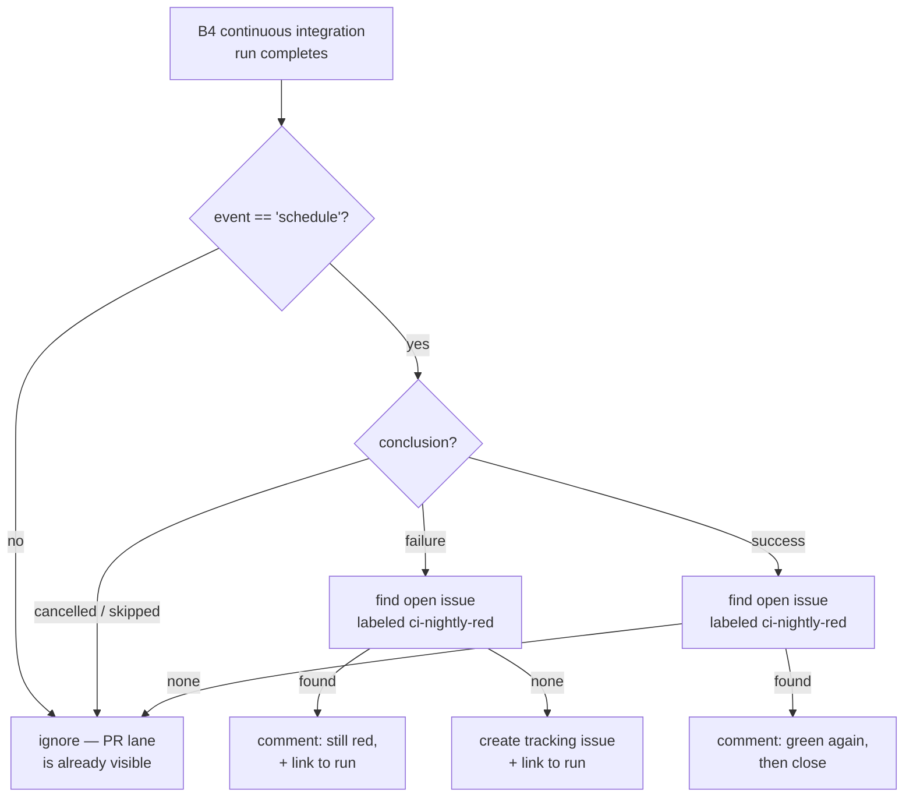

# feat: Surface failed nightly CI runs automatically

## Summary

`main`'s scheduled tier-2 CI gate has been red for at least three consecutive
nights with nothing surfacing it. Add one standalone workflow that opens (or
updates) a single tracking issue when a scheduled `B4 continuous integration`
run fails, and closes it when a later scheduled run goes green.

Two files, both new. No existing workflow, test, or frozen surface is modified.

---

## Problem Frame

The repository runs a deliberate two-tier CI gate (`.github/workflows/ci.yml`):

| Event | What runs |
|---|---|
| `pull_request` | `npm run test:fast` — a subset; Android and iOS lanes skip entirely |
| `schedule` / `push` / `merge_group` | the full fail-closed gate |

Tier 1 is watched, because a red PR blocks its own merge. **Tier 2 is watched by
nobody.** Scheduled runs `30892917245` (2026-08-04), `30989859384` (2026-08-05),
and `31085773351` (2026-08-06) all failed with the identical four tests, and the
breakage was found only by a manual branch-health sweep on 2026-08-06.

The gap is structural, not incidental. `npm run test:fast` explicitly excludes
`native-wrapper-contract.test.mjs`, every `*.slow.test.mjs`, and the `*.live.mjs`
files — so the drift that broke tier 2 could never have been caught by tier 1.
Drift lands through a green PR and only the unwatched nightly sees it.

This plan does not attempt to fix the four failing tests or to narrow the tier
split. It closes the feedback loop so the next occurrence is noticed within a day.

---

## Requirements

- **R1** — A failed scheduled run of `B4 continuous integration` produces a
  visible, durable notification without human polling.
- **R2** — A persistently-red nightly must not produce one new notification per
  night. Repeat failures update a single tracking record.
- **R3** — When a later scheduled run succeeds, the tracking record resolves
  itself, so an open record always means "currently red".
- **R4** — The notification names the failing run and links to it, so triage
  starts from evidence rather than a rerun.
- **R5** — No existing workflow, contract test, or hash-pinned surface is modified.
- **R6** — The new workflow's own structure is contract-tested, mirroring how
  `ci.yml` is protected.

---

## Key Technical Decisions

### KTD1. New standalone workflow file, not a change to `ci.yml`

*(session-settled: user-approved — chosen over adding a notification job inside
`ci.yml`: `tests/ci-workflow-contract.test.mjs` hard-asserts ci.yml's exact job
count, checkout SHA, node version count, and push-branch list, so editing it
trips the freeze contract.)*

`tests/ci-workflow-contract.test.mjs:44` asserts `ci.yml` has **exactly three**
jobs. Line 32 pins `actions/checkout@df4cb1c069e1874edd31b4311f1884172cec0e10`.
Line 45 requires `node-version: "24.18.0"` exactly three times. A notification
job added inside `ci.yml` breaks all three assertions, and the only way to make
them pass again is to edit the frozen expectations — the precise thing this
repo's governance exists to prevent.

A separate file is also the correct decoupling: alerting must still fire when
the CI run itself dies, and a job inside the failing workflow cannot be relied
on to run when the workflow fails.

### KTD2. Trigger on `workflow_run` completion, filtered to `schedule` + `failure`

*(session-settled: user-approved — chosen over alerting on every CI failure
regardless of event: `pull_request` failures are already visible on the PR, so
alerting on them is pure noise; the unwatched gap is specifically the scheduled
tier-2 run.)*

`workflow_run` fires after the upstream workflow concludes, so it observes the
real outcome rather than racing it. The filter is
`conclusion == 'failure' && event == 'schedule'`.

### KTD3. One reusable tracking issue, found by label

Rather than `gh issue create` per failure (R2), the job searches for an open
issue carrying the `ci-nightly-red` label. Found → add a comment naming the new
run. Not found → create one. This makes three consecutive red nights one issue
with three comments instead of three issues.

Label-based lookup rather than title-matching: titles will carry run numbers and
dates, labels stay stable.

### KTD4. Auto-close on a green scheduled run

*(chosen over leaving the issue for a human to close: an alert channel that
accumulates stale open records stops being read, which reproduces the original
problem in a new place.)*

The same workflow handles `conclusion == 'success' && event == 'schedule'` by
closing any open `ci-nightly-red` issue with a comment naming the green run.
An open issue therefore always means "tier 2 is red right now".

### KTD5. Least-privilege permissions, `GITHUB_TOKEN` only

Every workflow in this repo declares an explicit `permissions:` block
(`certify.yml:8`, `ci.yml:21`, both PR gates). This one needs `issues: write`
and nothing else — `contents: read` is not required, since the job never checks
out the tree. The default `GITHUB_TOKEN` can create and close issues in its own
repository; no PAT or secret is introduced.

### KTD6. No frozen surface is touched

*(session-settled: user-directed — chosen over updating frozen expectations to
make anything pass: the hash-freeze design exists to force a human attestation,
and auto-regenerating it defeats the control.)*

Verified against the two surfaces that could have constrained this work:
- `tests/ci-workflow-contract.test.mjs` reads `ci.yml` only — a new file is invisible to it.
- `tests/helpers/b3-repository-invariant-scanner.mjs` scans `.github/workflows`
  (line 40) but only for reappearing deleted B3 authority modules and symbols.
  The new workflow references none of them.

---

## High-Level Technical Design

Directional guidance for review — the implementer owns the exact step shape.

---

## Scope Boundaries

**In scope**
- One new workflow file covering scheduled tier-2 failure and recovery.
- One new contract test asserting that workflow's structure.

**Out of scope**
- Fixing the four currently-failing nightly tests. Tracked separately; PR #68
  addresses one of them plus half of a second.
- Changing the tier-1 / tier-2 split, or what `test:fast` excludes. That split
  is deliberate; widening it is a separate decision with real CI-cost tradeoffs.
- Any edit to `ci.yml`, its contract test, or any hash-pinned surface (KTD6).

### Deferred to Follow-Up Work
- Extending coverage to `push` and `merge_group` tier-2 failures. Scheduled-only
  is the settled scope for this change (KTD2); the same workflow can widen its
  filter later if push failures also prove to go unwatched.
- Routing to a channel outside GitHub (email, Slack). A tracking issue is the
  zero-dependency sink; an external channel needs a secret and a decision about
  where it lands.

---

## Assumptions

Recorded rather than asked, per pipeline-mode planning:

- **A1** — GitHub Issues is enabled on `fol2/ks2-spelling`. If it is not, the
  workflow's create step fails and the alert channel does not exist; the
  implementer should verify this before the first merge.
- **A2** — The `ci-nightly-red` label may not exist yet. `gh issue create
  --label` fails on an unknown label, so the implementation must create the
  label if missing, or the first alert silently fails.
- **A3** — The repository's Actions queue is currently stuck (two runs sat
  queued for hours on 2026-08-06 without starting). CI verification of this
  change may not complete in the same session. This is an environment condition,
  not a defect in the change.

---

## Implementation Units

### U1. Add the nightly CI failure alert workflow

**Goal** — A scheduled tier-2 failure opens or updates a single tracking issue;
a scheduled success closes it.

**Requirements** — R1, R2, R3, R4, R5. Implements KTD1, KTD2, KTD3, KTD4, KTD5.

**Dependencies** — none.

**Files**
- `.github/workflows/nightly-alert.yml` (create)

**Approach**
- `on: workflow_run:` with `workflows: ["B4 continuous integration"]`, `types: [completed]`.
- Job-level `if:` gates on `github.event.workflow_run.event == 'schedule'`, so
  every non-scheduled completion exits without spending a runner.
- Two jobs, or one job with two guarded steps — implementer's call. The failure
  path and the recovery path share the "find the open labelled issue" lookup, so
  a single job with a shared lookup step is the smaller shape.
- `permissions: issues: write` only (KTD5). No checkout step — the job needs no
  repository contents.
- Use `gh` via `GH_TOKEN: ${{ secrets.GITHUB_TOKEN }}`; `gh` is preinstalled on
  `ubuntu-24.04` runners.
- Ensure the `ci-nightly-red` label exists before first use (A2) — `gh label
  create --force` is idempotent and safe to run every time.
- Issue body and comments must link `github.event.workflow_run.html_url` and
  name the run number and conclusion (R4).
- Follow house style observed across all four existing workflows: `name:`, `on:`,
  explicit `permissions:`, `concurrency:`, then `jobs:`.
- **Key the concurrency group to `workflow_run.id`, not to the workflow.** Every
  CI completion enters this workflow, including the `pull_request` ones the job
  skips. Under a shared group, GitHub cancels an already-pending run when a newer
  one joins — so a skipped PR-triggered alert could cancel a still-pending
  scheduled alert, and on the first red night no issue would be created at all.
  A per-run key still prevents double-processing of one triggering run.

**Patterns to follow**
- `.github/workflows/certify.yml:1-13` — header shape, explicit permissions,
  concurrency group naming (`b4-certify-${{ github.ref }}`).
- `.github/workflows/ci.yml:21-26` — least-privilege permissions block and
  concurrency convention.
- Label vocabulary from `.github/dependabot.yml` — the repo already uses
  `manual-review` as a triage label; apply it alongside `ci-nightly-red`.

**Test scenarios** — covered by U2's contract test rather than by executing the
workflow (a `workflow_run` trigger cannot be exercised locally):
- The workflow triggers on `workflow_run` for exactly `B4 continuous integration`.
- The scheduled-event filter is present and gates every job.
- The failure path and the success path are both present and mutually exclusive.
- `permissions:` grants `issues: write` and does not grant `contents: write`.
- No checkout action appears (the job needs no tree, and adding one would widen
  the token scope for nothing).

**Verification** — `npm run test:fast` passes with U2's new test included.
`actionlint` or `gh workflow view` parses the file if available; otherwise YAML
validity is proven by the contract test reading and parsing it.

---

### U2. Contract-test the new workflow's structure

**Goal** — The alert workflow cannot silently lose its trigger, its scheduled
filter, or its least-privilege permissions.

**Requirements** — R6. Guards KTD2 and KTD5 against future drift.

**Dependencies** — U1.

**Files**
- `tests/nightly-alert-workflow-contract.test.mjs` (create)

**Approach**
- Mirror the existing `tests/ci-workflow-contract.test.mjs` shape: read the
  workflow file as text, assert on its structure.
- Deliberately assert *behavioral* structure — trigger name, scheduled filter,
  both conclusion paths, permission scope — not incidental formatting. An
  over-tight contract test becomes the same freeze burden this plan avoided in
  KTD1.
- The file lands in `tests/` at depth 1 with a `.test.mjs` extension, so
  `npm run test:fast` picks it up automatically and it runs in the PR lane.

**Patterns to follow**
- `tests/ci-workflow-contract.test.mjs:29-54` — `readWorkflow()` helper, regex
  assertions against workflow text, one `test()` per invariant.

**Test scenarios**
- Workflow triggers on `workflow_run` naming exactly `B4 continuous integration`.
- The `schedule` event filter is present.
- A failure-conclusion path and a success-conclusion path both exist.
- `permissions:` includes `issues: write`.
- `permissions:` does **not** grant `contents: write` or `pull-requests: write`.
- The workflow declares a `concurrency:` group.
- The file is parseable and non-empty (guards against a truncated write).

**Verification** — `npm run test:fast` passes, with the new test executing and
failing if U1's workflow is altered in any of the asserted dimensions.

---

## Verification Contract

- `npm run test:fast` — green, including the new contract test.
- `npm run lint` — green.
- `tests/ci-workflow-contract.test.mjs` — still green and **unmodified** (proves
  KTD1: `ci.yml` was not touched).
- `git diff --stat` against `main` shows exactly two added files and zero
  modified files.
- End-to-end proof of the alert firing requires a real failed scheduled run and
  cannot be produced on demand. Per A3 the Actions queue is currently stuck, so
  first real-world confirmation will arrive with the next nightly.

---

## Definition of Done

1. `.github/workflows/nightly-alert.yml` exists and satisfies U1's scenarios.
2. `tests/nightly-alert-workflow-contract.test.mjs` exists and passes.
3. `npm run test:fast` and `npm run lint` are green.
4. No file outside those two is added, modified, or deleted.
5. `tests/ci-workflow-contract.test.mjs` passes unmodified.

---

## Risks

| Risk | Likelihood | Mitigation |
|---|---|---|
| `ci-nightly-red` label does not exist; first alert fails silently (A2) | High | Idempotent `gh label create --force` before use, asserted in U2 |
| GitHub Issues disabled on the repo (A1) | Low | Implementer verifies before merge; failure is loud, not silent |
| A skipped PR-triggered alert cancels a pending scheduled alert, losing the first red night entirely | Medium before mitigation | Concurrency keyed to `workflow_run.id` rather than shared; asserted in U2 |
| Two rapid completions race into two issues | Very low | One scheduled run per day; per-run concurrency key prevents double-processing of the same run |
| Contract test in U2 becomes its own freeze burden | Medium | Assert behavioral structure only, never formatting or SHAs (U2 approach) |
| Alert never verified because the Actions queue is stuck (A3) | High | Accepted; the change is inert until a scheduled run completes, and carries no risk to existing lanes |

---

## Open Questions

- **Q1** *(deferred, non-blocking)* — Should tier-2 failures from `push` and
  `merge_group` also alert? Scheduled-only is settled for this change (KTD2).
  Revisit if a push-lane failure is ever missed.
- **Q2** *(deferred, non-blocking)* — Should the tracking issue be assigned to a
  specific owner? Left unassigned; the repo is single-maintainer, so a label is
  sufficient routing.

---

## Sources & Research

- `.github/workflows/ci.yml:1-30` — two-tier gate definition and the
  `pull_request` / non-`pull_request` step guards.
- `.github/workflows/certify.yml:1-13` — workflow house style.
- `tests/ci-workflow-contract.test.mjs:29-54` — the freeze contract on `ci.yml`
  that KTD1 routes around, and the pattern U2 mirrors.
- `tests/helpers/b3-repository-invariant-scanner.mjs:39-50` — confirms
  `.github/workflows` is a scanned root, and that the scan targets only deleted
  B3 authority symbols (KTD6).
- `package.json` `test:fast` — the exclusion list proving tier 1 cannot catch
  the class of drift that broke tier 2.
- `.github/dependabot.yml` — existing label vocabulary (`manual-review`).
- Failed scheduled runs `30892917245`, `30989859384`, `31085773351` — the
  three-night evidence motivating R1.
</content>
</invoke>
